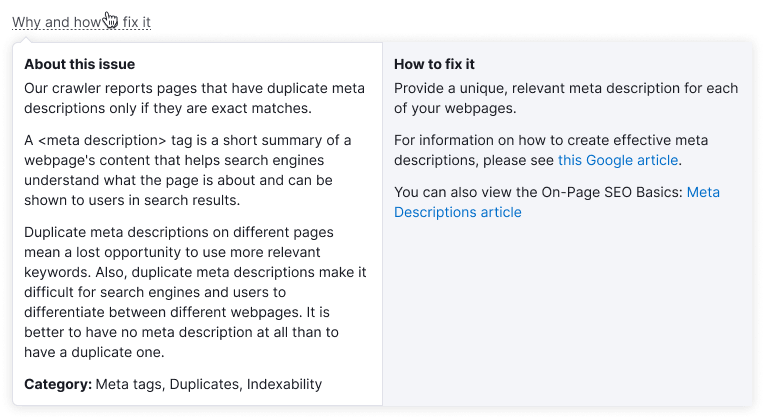
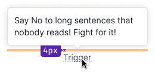
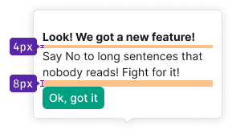
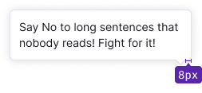
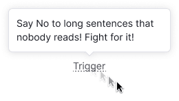
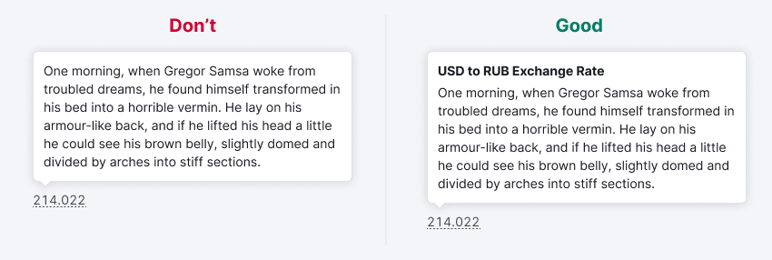

@import playground

@## Description

**Tooltip** is a modeless popover to display all sorts of tips in tools.

Differences from [Dropdown](/components/dropdown/):

- It appears only at hovering over the trigger.
- It has an arrow that points to the trigger.
- It contains only hints and additional information without controls.

@## Component composition

- container;
- content;
- chevron.

@## Types

There are two types of tooltips:

- default;
- advanced.

### Default tooltip

Default tooltip contains only unformatted text.

### Advanced tooltip

The advanced tooltip may contain:

- formatted text;
- simple controls ([Button](/components/button/), [Link](/components/link/), etc.);
- custom marking;
- image;
- different background color.

@## Themes

The tooltip has themes to use on a dark background and for error messages. In both cases, the text color changes to `#fff` and the background color changes to the corresponding one.

|               | Appearance                             | Styles                                                                                                 |
| ------------- | -------------------------------------- | ------------------------------------------------------------------------------------------------------ |
| Invert theme  |    | `background-color: --var(gray800); border: 1px solid #6C6E79; box-shadow: 0px 1px 12px 0px #191B2326;` |
| Warning theme |  | `background-color: --var(red100); border: 1px solid #FF4953; box-shadow: 0px 2px 5px 0px #00000040;`   |

> 💡 In [3.1.0 version](http://i.semrush.com/components/tooltip/#Changelog), you can set your own theme and change background color to custom.

@## Sizes, paddings and margins

### Sizes

The basic tooltip has a maximum width — `max-width: 250px`. In the advanced version of the tooltip, you can set a different width if necessary.

### Offset

The offset from the trigger to the tooltip is 4px.

### Paddings and margins

**Content**. The content area of the component has defaul padding.

### Recommendations for indents within content

> 💡 Please note that it is better to use 14px for the title in the default non-advertising tooltip.

Image area is 256px х 132px.

**Arrow**. Arrow can be placed either in the middle of the component or next to any angle.

### Margins inside the data

To make tooltip data more readable we have specific rules for margins between the labels and values.

See detailed examples for tooltip margins in [Data visualization](/data-display/chart/#ac9830) and [Summary](/patterns/summary/#a16f52).

@## Placement

- Tooltip is built on the basis of the [Popper.js](https://popper.js.org/) library. So you can change the placement of the component according to [Popper API](/utils/popper/popper-api/).

- By default, tooltip appears while hovering the trigger. It shouldn't change its position when scrolling a page (for example, if it appeard upwards, but when scrolling it appeared at the edge of the browser and moved down) so that it remains where it was originally opened. The default tooltip placement — top.

Possible positions towards the trigger:

@example placement

@## Interaction

The tooltip trigger can be a formatted text, table header, or various controls such as [Icon](/style/icon/), [Link](/components/link/), [Button](/components/button/) etc.)

### Appearance and hiding

| Hidden                                                                            |                                |
| --------------------------------------------------------------------------------- | ------------------------------ |
| Cursor left the trigger (for basic tooltip)                                       |  |
| Cursor left the trigger or the tooltip itself (for advanced tooltip with control) |  |

### Delay of appearance and hiding

Default values for tooltip appearance and hiding:

- appearance: `100ms`;
- hiding: `50ms`.

If there are controls in your tooltip, which appears when you hover over a trigger, the time for hiding the tooltip should be increased to `100ms`.

@## Use in UX/UI

### Recommendations for use

Use the tooltip to show hints and additional information to the user. This can be text, formatted text with lists, links, buttons and small images.

> 💡 For more complex content and features, use [Dropdown-menu](/components/dropdown-menu/).

Make sure that the tooltip does not overlap the information important for the user, which is necessary in the context of use.

**If the tooltip falls out of the trigger that tells about the new feature, the tooltip title should not duplicate the text of the trigger.** The title may not be used if the trigger text already explains the tooltip content to a sufficient extent. For example, you should not duplicate the text of the trigger in the tooltip, as it is redundant.

> 💡 If the text in the element is too long and shortened into an `ellipsis` (...), show the full text in the tooltip.

**In the case when the essence of the trigger is not obvious enough, it is better to add a title to the tooltip.** It is also necessary to add a title when the trigger does not sufficiently explain the topic of the tooltip. For example, you can describe additional conditions in the header, or expand the idea behind the trigger.

**The long text of the tooltip must be divided into paragraphs.**

**Do not overload the tooltip with information.** The large amount of content is inconvenient to view in the tooltip. If there is too much content and you cannot remove anything, think about whether you need a separate paragraph on the page or widget for it instead of a tooltip.

**A tooltip with an interactive element inside should not prevent you from pointing the cursor at a nearby trigger.**

@page tooltip-a11y
@page tooltip-api
@page tooltip-code
@page tooltip-changelog
